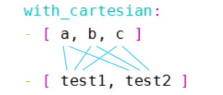

> #### 作者：孙科伟
## 1. 标准loops循环
ansible playbook循环主要是为了解决重复使用task。比如批量安装软件。按照以前的思路可能需要写多个task任务来安装多个软件。而通过循环，我只需要写一个task就可以。
* with_items 循环
1.  例：批量安装软件，可以直接跟列表。

```
  - name: install kubeadm，kubelet and kubectl
    yum:
      name:
        - kubelet-1.15.0
        - kubeadm-1.15.0 
        - kubectl-1.15.0
      state: installed 
```

2. 例：通过标准循环方式安装软件
  
```
  - name: install kubeadm，kubelet and kubectl
    yum:
      name: "{{item}}"
      state: installed 
    with_items:
       - kubelet-1.15.0
       - kubeadm-1.15.0 
       - kubectl-1.15.0  
```

等效于：
```
  - name: install kubeadm，kubelet and kubectl
    yum:
      name: "{{item}}"
      state: installed 
    with_items: [ kubelet-1.15.0,kubeadm-1.15.0,kubectl-1.15.0 ]
```

等效于：
```
 - name: install kubeadm，kubelet and kubectl
    yum:
      name: "{{item}}"
      state: installed 
    with_items:
        -  [  kubelet-1.15.0,kubeadm-1.15.0 ]
        -  [ kubectl-1.15.0 ]        
```
等效于：
```
 - name: install kubeadm，kubelet and kubectl
    yum:
      name: "{{item}}"
      state: installed 
    with_flattened:
        -  [  kubelet-1.15.0,kubeadm-1.15.0 ]
        -  [ kubectl-1.15.0 ]   

```
当with _items为多个列表的时候（这时候也可以用关键字with_flattened，意思是一样的），这会以此循环输出每个列表的值。因此item的值分别为kubelet-1.15.0，kubeadm-1.15.0， kubectl-1.15.0 。和单个列表没什么区别。可以看结果```：changed: [10.2.1.196] => (item=[u'wget', u'vim', u'lrzsz'])```


  3. 例：通过字典的方式，批量copy文件
     with_items的值是python list数据结构，可以理解为每个task会循环读取list里面的值，然后key的名称是item，当然list里面也支持python 字典，
 ```
 - name: install kubeadm，kubelet and kubectl
    copy:
        src: "{{ item.src }}"
        dest: "{{ item.dest }}"
    with_items:
       - {src: "/opt/docker-ce.repo", dest: "/etc/yum.repos.d/docker-ce.repo" }
       - {src: "/opt/kubernetes.repo", dest: "/etc/yum.repos.d/kubernetes.repo" }
 ```
* with_list 多列表循环：
  
当使用with_items时，且为多个列表时，则会以此循环每个列表内的值。详见例3最后等效于。item会循环3次，每个值依次为，kubelet-1.15.0，kubeadm-1.15.0 ， kubectl-1.15.0 。如果想每次循环整个列表作为整体。则使用with_list.
```
---
- hosts: node1
  remote_user: root
  tasks:
    - name: install kubeadm，kubelet and kubectl
      yum:
        name: "{{ item }}"
        state: installed 
      with_list:
         - [ wget,vim ]
         - [ lrzsz ]
```
则输出结果为：```changed: [10.2.1.196] => (item=[u'wget', u'vim'])
changed: [10.2.1.196] => (item=[u'lrzsz'])```

* with_together 对齐合并：
```
---
- hosts: node1
  remote_user: root
  tasks:
    - name: install kubeadm，kubelet and kubectl
      debug:
        msg: "{{ item }}"
      with_together:
         - [ 1,2,3 ]
         - [ a,b,c]

```

  结果是：1->a,2->b,3-C
  ```
  ok: [10.2.1.196] => (item=[1, u'a']) => {
    "msg": [
        1, 
        "a"
    ]
}
ok: [10.2.1.196] => (item=[2, u'b']) => {
    "msg": [
        2, 
        "b"
    ]
}
ok: [10.2.1.196] => (item=[3, u'c']) => {
    "msg": [
        3, 
        "c"
    ]
}

  ```
  如果列表的数目不通，这没有匹配到的输出为null。 例如列表为[1,2] [a,b,c,] 这结果为1->a,2->b,null->c .同理如果列表为[1,2,3] [a,b]则输出结果为[1,a] [2,b] [3,null]


* with_cartesian 与with_nested：
如果想创建用拥有相同子目录的文件，例如创建目录：/data1/mysql1  /data1/mysql2  /data2/mysql1 /   /data2/mysql2.目录 data1和data2下用友想想他的目录mysql1和mysql2.则可以用到with_cartesian
- name: Create /etc/docker directory 
  file:
    path: /{{ item.0 }}/{{item.1}}
    state: directory
    mode: "0755"
 with_nested: 
   - [ data1,data2 ]
   - [ mysql1,mysql2 ]

item输出结果为：
```
changed: [10.2.1.196] => (item=[u'data1', u'mysql1'])
changed: [10.2.1.196] => (item=[u'data1', u'mysql2'])
changed: [10.2.1.196] => (item=[u'data2', u'mysql1'])
changed: [10.2.1.196] => (item=[u'data2', u'mysql2'])

```
从输出信息可以看出，第一个小列表中的每个元素与第二个小列表中的每个元素都"两两组合在了一起"，如下图所示:



